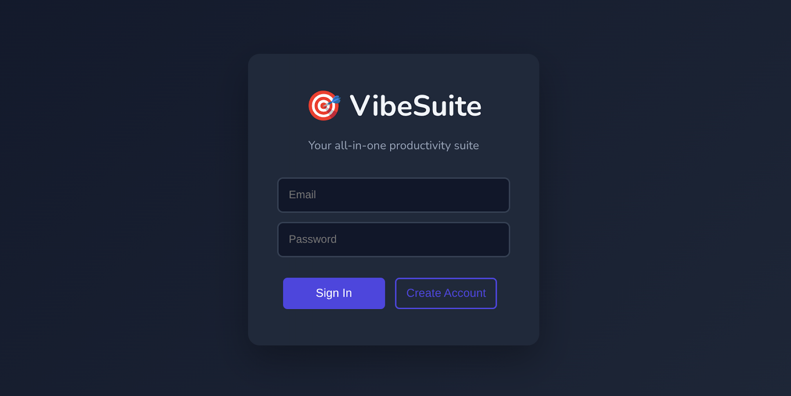

# 🎯 VibeSuite - All-in-One Productivity Suite
A unified SaaS application combining [Turbo-Do](https://github.com/alphasecio/vibe-challenge/tree/main/challenge01) task management and [Linkwise](https://github.com/alphasecio/vibe-challenge/tree/main/challenge02) link aggregation with AI-powered features.



### ✨ Features
* **Single Sign-On**: One account for all productivity tools
* **🏁 Turbo-Do**: Race-themed to-do list with completion animations
* **📚 Linkwise**: AI-powered link aggregation with automatic summaries and tags
* **Tab Navigation**: Seamless switching between tools
* **Responsive Design**: Works beautifully on all devices

### 🛠️ Tech Stack
#### **Frontend**
  * **HTML5** for structure  
  * **CSS3** for layout, animations, and styling  
  * **Vanilla JavaScript** for dynamic behavior
#### **Backend**
  * **Flask (Python)** for backend API
  * **Firebase Authentication** for user authentication
  * **BeautifulSoup** for content extraction from links
  * **Gemini on Vertex AI** for generating summaries, titles and tags
  * **Firestore Database** for storing links, summaries, titles and tags

### ⚙️ Environment Variables
Required by Google Cloud Run (ideally, as secret references) or `.env` for local deployment.
* `GOOGLE_CLOUD_PROJECT`=`your-gcp-project-id`
* `GOOGLE_CLOUD_LOCATION`=`your-gcp-region`

### 👤 Identity & Access Management
Create a new service account `vibesuite-sa` in your project, and assign the following roles. Use this account for Cloud Run service deployment.
* `Secret Manager Secret Accessor`
* `Vertex AI User`
* `Cloud Datastore User`

### 🔐 Firebase Authentication & Frontend Setup
Create a new project in the Firebase console, then enable the `Email/Password` provider from `Build` > `Authentication`.

In `static/app.js`, configure the app details:
```javascript
const firebaseConfig = {
  apiKey: "YOUR_FIREBASE_API_KEY",
  authDomain: "YOUR_FIREBASE_PROJECT.firebaseapp.com",
  projectId: "YOUR_FIREBASE_PROJECT",
};
```
**Note**: These keys are safe for public use, as they only identify your project — not authenticate access. However, you should still restrict API key usage to the deployed website (`APIs & Services` > `Credentials`).

### 🔥 Firestore Database & Security Rules
From `Build` > `Firestore Database`, create a `Standard edition` database, choose your location, and enable `Production` mode.

Each user's saved link is stored under a top-level links collection:
```
links/
  <linkId> {
    userId: "firebase-uid",
    url: "https://example.com",
    title: "Example Article",
    summary: "Generated summary by Gemini",
    tags: ["AI", "GoogleCloud", "Security"],
    createdAt: <timestamp>
  }
```

Go to `Indexes`, and add a `Composite` index as follows:
* `Collection ID`: `links`
* Fields to index
  * `userId`: `Ascending`
  * `createdAt`: `Descending`

Under `Rules`, use this to restrict access per user:
```
rules_version = '2';
service cloud.firestore {
  match /databases/{database}/documents {
    match /links/{linkId} {
      allow read, delete: if request.auth != null && request.auth.uid == resource.data.userId;
      allow create: if request.auth != null && request.auth.uid == request.resource.data.userId;
    }
  }
}
```

### 🚀 Deployment (Cloud Run)
```bash
gcloud builds submit --tag gcr.io/$GOOGLE_CLOUD_PROJECT/vibesuite
gcloud run deploy vibesuite \
  --image gcr.io/$GOOGLE_CLOUD_PROJECT/vibesuite \
  --platform managed \
  --region=$GOOGLE_CLOUD_LOCATION \
  --allow-unauthenticated
```
